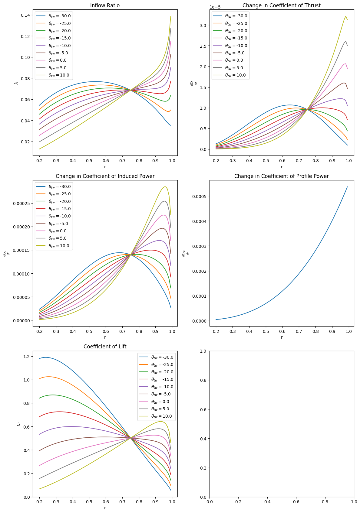

# Report for homework 3
### Benjamin Tollison

# Table of Contents
- [Report for homework 3](#report-for-homework-3)
    - [Benjamin Tollison](#benjamin-tollison)
- [Table of Contents](#table-of-contents)
- [Outputting the plots](#outputting-the-plots)
  - [Unit Test Jupyter Notebook](#unit-test-jupyter-notebook)
  - [GradingPurposes python files](#gradingpurposes-python-files)
- [Problem 1](#problem-1)
  - [Given Variables](#given-variables)
  - [Exact case](#exact-case)
  - [Numerical Case](#numerical-case)
- [Problem 2](#problem-2)
  - [New BEMT scheme](#new-bemt-scheme)
  - [Equations that use the new BEMT](#equations-that-use-the-new-bemt)
- [Problem 3](#problem-3)
- [Problem 4](#problem-4)
- [Problem 5](#problem-5)

# Outputting the plots
## Unit Test Jupyter Notebook
All the plots are pre-outputed in the Unit Test jupyter notebook so that you don't have to run the code to see the plots outside of this report. If you just want to print out the plots with current python environment, then you can just run all the blocks in the Unit Test notebook. Note: If you run the Unit Test the final mesh is tuned down to 100 points instead of 500, so the computation time will not be as long.

## GradingPurposes python files
I have created a python script that will feed you prompts on getting the plots by producing a temporary python environment and delete it after producing the plots, so that it will not interfere with any environment that you currently have on your system. Running this script will let you enable gpu acceleration option for seeing the difference in the computation times as the mesh size increases for graphing the surface plot, due to the computation time of the graphing is \(O(n^2)\). 

Due to my laptop having limited vram, I had to downsample the mesh to 16 bit numbers to properly expand the radius vector in the 3 dimensions to perform the integral. After \(C_T = \sum_{r_n=r_0}^{r_n=1}{\Delta{C_T}}\) the mesh goes back to 32 bit floats. Due to not figuring out how to prevent complex numbers from the Coefficient of ideal power when coefficient of thrust goes negative, the GPU calcuations only plots up to Coefficients of Power because edge cases causing the FM going to infinity and I don't want to use if/else statements to bandaid the improper vectorization of the CPU code.

# Problem 1
The first problem is the simplist case because the only variable that is changing is the normalized radius from zero to one. \(\frac{y}{L} = r|r\text{ } \in [0,1]\)
## Given Variables
$$
\sigma = 0.1,\text{ } C_T = 0.008, \text{ } C_{l\alpha} \approx 2\pi
$$
$C_T$ only varies when finding $C_T = \int\Delta{C_T}$ and $C_{Pi}$
## Exact case
The equations to find the exact solutions were the following:
$$
\lambda_h(C_T) = \sqrt{\frac{C_T}{2}}
$$
$$
\theta_{ideal} = \frac{\theta_{tip}}{r}|\theta_{tip} = \frac{4C_T}{\sigma} + \lambda_h
$$
$$
C_l = \frac{4C_T}{\sigma}\frac{1}{r}
$$
$$
C_P = C_Q = \frac{C_T^\frac{3}{2}}{\sqrt{2}}
$$
## Numerical Case
The objective function that I am going to try to minimize below a tolerance of 1e-6 ($\epsilon$) is the following:
$$
\text{Objective Function} = \tau(\lambda,\theta)= \lambda_i^2 + \frac{\sigma C_{l\alpha}}{8}\lambda_i - \frac{\sigma C_{l\alpha}}{8}\theta r
$$
Intial conditions are going to be $\lambda_0 = \lambda_h$ and $\theta_0 = \theta_{ideal}$ in order to setup the intial guesses to be close when tiploss is introduced. The movement of the variables is caused by:
$$
\lambda_{i+1} = \frac{\sigma C_{l\alpha}}{16}\left[\sqrt{1 + \frac{32}{\sigma C_{l\alpha}}\theta r} - 1\right]
$$
$$
\theta_{tip,i+1} = \frac{4C_T}{\sigma} + \lambda_{i+1}
$$
$$
\theta_{i+1} = \frac{\theta_{tip,i+1}}{r}
$$
I will loop through these functions until $||\tau_{(\lambda_{i+1},\theta_{i+1})}|| \leq \epsilon$. After solving these functions for the inflow ratio, we can plug into the exact equations but with this new approximated inflow and compare it to the exact inflow with the following graphs.

Note that the Coefficient of Power Induced and Coefficient of Torque are graphed as functions of radius from zero to one because the numerics fail after passing my max found $C_T = 0.08$ 

# Problem 2
The only things that change in this problem are implimenting Prandtl's tip-loss function, removing the blades twist, and changing the number of blades on the hub. To increase numerical robustness, I set the blade to have constant twist. $\theta = \theta_{tip} = \frac{4 C_T}{\sigma C_{l\alpha}} + \sqrt{\frac{C_T}{2}}$
## New BEMT scheme
$$
\tau(\lambda,\theta)= \lambda_i^2 + \frac{\sigma C_{l\alpha}}{8F}\lambda_i - \frac{\sigma C_{l\alpha}}{8F}\theta r
$$
$$
\lambda_{i+1} = \frac{\sigma C_{l\alpha}}{16F}\left[\sqrt{1 + \frac{32F}{\sigma C_{l\alpha}}\theta r} - 1\right]
$$
$$
f_{i+1} = \frac{N_b}{2}\left(\frac{1-r}{\lambda_{i+1}}\right)
$$
$$
F_{i+1} = \frac{2}{\pi}\cos^{-1}\left(e^{-f}\right)
$$
Where starting conditions are $\lambda_0 = \lambda(r_n,F=1), f_0 = f(r_n,\lambda_0), F_0 = F(f_0)$. The BEMT scheme from before is what is used to find the no tip loss, or F = 1. To properly do the integrals, I just took a sum of all the piece-wise segments of r from 0 to 1. Therefore moving forward, instead of using $\int$ notation I will use $\sum$ notation to maintain consistency with the discrete nature of the code.
## Equations that use the new BEMT
$$
\frac{\Delta C_T}{\Delta r} = \frac{\sigma C_{l\alpha}}{2}\left(\theta r_n^2 - \lambda r_n\right)
$$

$$
\frac{\Delta C_Q}{\Delta r} = 
\frac{\Delta C_P}{\Delta r} = \lambda \frac{\Delta C_T}{\Delta r} + \frac{1}{2}\sigma C_d r_n^3 \text{ }\text{ } |C_d \approx C_{d_0} = 0.011
$$
$$
C_l = C_{l\alpha}\left(\theta - \frac{\lambda}{r}\right)
$$
$$
C_T = \sum_{n=0}^{N} = \Delta C_T, \text{ }C_{Pi} = \sum_{n=0}^{N} \lambda_{(r_n,N_b)} \Delta C_{T(r_n)}
$$
$$
\rightarrow\kappa = \frac{C_{Pi}\sqrt{2}}{C_T^\frac{3}{2}}
$$
These equations produce the following graphs

# Problem 3
We build upon problem 2 in problem 3 by adding back twist. In this case we will be using linear twist
$$
\theta(r_n) = \theta_0 + \theta_{tw} r_n
$$
and the root twist $(\theta_0)$ is a function of the twist rate for the best approximation of the hyperbolic ideal twist used in [Problem 1](#problem-1).
$$
\theta_0 = \frac{6 C_T}{\sigma C_{l\alpha}} - \frac{3}{4}\theta_{tw} + \frac{3}{2} \sqrt{\frac{C_T}{2}}
$$
The BEMT scheme doesn't change except we calculate the twist at every iteration again. Calculating the same functions except the power factor, adding profile power, and the change in coefficient of thrust to reduce computational overhead with a different equation from the textbook.

New $C_T$:
$$
\Delta C_T = 4F\lambda^2 r_n \Delta r_n
$$
Profile drag:
$$
\frac{\Delta C_{P_0}}{\Delta r} = \frac{1}{2} = \sigma C_d r_n^3
$$
These changes produce the following graphs

# Problem 4
Following the same parameters as the previous problem except this time we are changing the approximation for coefficient of drag to 
$$
C_d(\alpha) = 0.011 - 0.025\alpha + 0.65\alpha^2
$$
where $\alpha = \theta -\frac{\lambda}{r}$ and the required coefficient of power is the induced power added with the profile power with this equation:
$$
C_P = \sum_{n=0}^{N} \lambda \Delta C_T + \frac{1}{2} \sigma C_d r_n^3 \Delta r_n
$$

$$
C_{P,ideal} = \frac{C_T^\frac{3}{2}}{\sqrt{2}}
$$
$$
FM = \frac{C_{P,ideal}}{C_P}
$$
From this we can produce the following graphs

# Problem 5
Finally the last feature to add to our BEMT method is allow for changing the geometry of the blade as we move down it. In this case we will use linear taper function to find the solidity of the blade as a function of normalized radius. Below is my derivation of finding the solidity from linear taper. First this is how I defined taper:
$$
\pi_{taper} = \frac{C_0}{C_{tip}}
$$
Where $C_0$ is the root cord length and $C_{tip}$ is the cord length at the tip. I know this is Dr. Cizmas' notation, but ever since taking his class I prefer defining important ratios as $\pi_\alef$ and the $\pi$ is the irrational ratio of circumference over diameter, which does not have a subscript. Starting from the equation of solidity:
$$
\sigma = \frac{N_b C(r)}{\pi r}
$$
We can then approximate the cord length to be linear with the rectangle solidity being the previous used constant with constant cord length.

Starting with linear cord boundary conditions:
$r=1 \rightarrow C(r) = C_{tip}$, and $r_0=0 \rightarrow C(r) = C_0$
The we can derive the linear cord equation with these:
$$
C(r) = a + br
$$
$$
C(0) = a +\cancel{br}
$$
$$
\Rightarrow a = C_0
$$
$$
C_{tip} = C_0 + b
$$
$$
\frac{C_0}{\pi_{taper}} = C_0 + b
$$
$$
\Rightarrow b = C_0\left(\frac{1}{\pi_{taper}} - 1\right)
$$
$$
\therefore C(r) = C_0 - C_0\left(1-\frac{1}{\pi_{taper}}\right) r
$$
The rectangular case is $(\sigma_0 = 0.1)$ which means the solidity does not change with r. We can define $C_0$ and therefore the linear solidity is now:
$$
C_0 = \frac{N_b C_0}{\pi} \Rightarrow \sigma(r) =\frac{N_b C_0}{\pi r} \left[1 -\left(1-\frac{1}{\pi_{taper}}\right) r \right]
$$

Now we will find the inflow, change in thrust, change in induced power, lift, with fixed twist and looking at the effects of taper ratio.

This figure of merit graph is where we allow the twist and taper change at the same time. I have set $\theta_{tw} \in [-80^\circ,10^\circ]$ and $\pi_{taper} \in [1,6]$ and I created a grid of 500 points. The graph describes the way to maximize the figure of merit is to have the difference between root and tip to be between ~40-50 degrees and maximize the taper. It makes sense that you want the root to have a high angle of attack and level out at the tip because the speed at the hub is very slow compared to the tip. Since the root is calcuated as a function of the tip twist,the graph is negative instead of giving the tip angle of attack. Obivously, we cannot have infinite taper to negate the tip loss and have a lot of root cord due to material limits in real life. The material of the blades will determind the amount of taper that we can achieve, but from the range I calculated $FM \propto \pi_{taper}$

